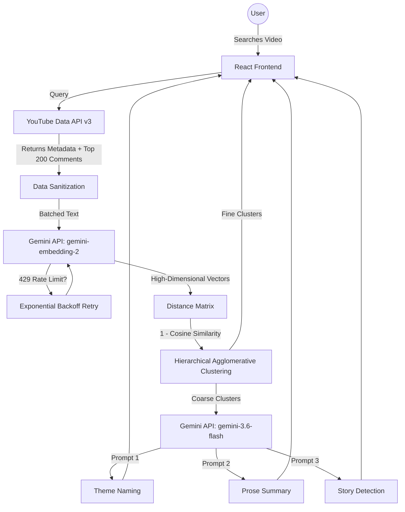

<div align="center">
  <h1>🎙️ VoxTube</h1>
  <p><em>Hear what thousands are saying.</em></p>
  <p>A smart YouTube comment analyzer that uses AI to transform comment section chaos into structured, meaningful insights.</p>
</div>

---

## 📖 About The Project

VoxTube analyzes YouTube comments using **Gemini AI embeddings** and **clustering algorithms** to uncover hidden patterns, overarching themes, and personal stories from any video's comment section. 

Popular videos have tens of thousands of comments, and nobody reads them all. VoxTube uses AI to help you understand what the crowd actually thinks, feels, and experiences.

## ⚙️ System Architecture



## 🛠️ Tech Stack

- **Frontend**: React, TypeScript, Vite
- **Styling**: Tailwind CSS, Framer Motion, Lucide Icons
- **AI & Data**: Gemini API (gemini-embedding-2 & gemini-3.6-flash), YouTube Data API v3

## 🧠 How It Works

1. **Fetch**: Retrieves top comments from the selected YouTube video.
2. **Embed**: Uses Gemini's `gemini-embedding-2` to convert text into high-dimensional vectors to measure semantic similarity.
3. **Cluster**: Groups comments based on their distance in the vector space.
4. **Analyze & Summarize**: Leverages `gemini-3.6-flash` to generate readable labels for clusters, extract personal stories, and write a concise prose summary of the overall sentiment.

## 🚀 Getting Started

### Prerequisites

You will need API keys for:
- [YouTube Data API v3](https://developers.google.com/youtube/v3)
- [Google AI Studio (Gemini API)](https://aistudio.google.com/app/apikey)

### Installation

1. **Clone the repository:**
   ```bash
   git clone <repository-url>
   cd voxtube
   ```

2. **Install dependencies:**
   ```bash
   npm install
   ```

3. **Configure Environment Variables:**
   Create a `.env` file in the root directory and add your API keys:
   ```env
   VITE_YOUTUBE_API_KEY=your_youtube_api_key_here
   VITE_GEMINI_API_KEY=your_gemini_api_key_here
   ```

4. **Run the development server:**
   ```bash
   npm run dev
   ```

5. Open [http://localhost:5173](http://localhost:5173) to view the app in your browser.

## 🤝 Contributing

Contributions, issues, and feature requests are welcome! Feel free to check the issues page.
